# Workflow AI

Workflow AI is a Spring Boot application for configurable AI agents. It exposes a REST/SSE chat API, browser pages, an
admin API for editable agent definitions, PostgreSQL-backed persistence, and pluggable LLM providers.

The project uses hexagonal architecture so the business rules stay independent from Spring MVC, JPA, static UI files,
and provider SDKs:

- `domain` contains pure business concepts, workflow policies, prompt-building rules, routing decisions, and validation
  criteria.
- `application` coordinates use cases: chat execution, conversation management, agent administration, provider
  selection, and pipeline orchestration.
- `ports` define the contracts between the application core and the outside world.
- `adapters` implement REST, static pages, database persistence, and provider-specific LangChain4j integrations.

---

## Architecture

This is the only architecture diagram in this README. The other diagrams below describe user-facing functionality and
runtime workflows without repeating ports/adapters terminology everywhere.

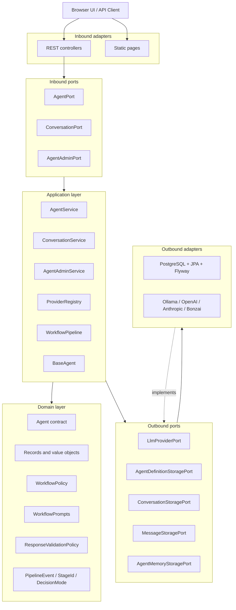

`ArchitectureTest` enforces the important dependency rules: adapters may depend inward, application may depend on ports
and domain, ports expose domain models, and domain remains technology-free.

---

## Package Structure

```text
src/main/java/io/workflowai
├── WorkflowAIApplication.java
├── domain
│   ├── agents              # Agent contract
│   ├── exceptions          # Domain/application exception types
│   ├── model               # Pure records: AgentDefinition, Conversation, LlmRequest, etc.
│   └── workflow            # WorkflowPolicy, WorkflowPrompts, StageId, PipelineEvent, validation policy
├── application
│   ├── AgentService.java
│   ├── AgentAdminService.java
│   ├── ConversationService.java
│   ├── ProviderRegistry.java
│   ├── agents              # BaseAgent runtime wrapper
│   └── pipeline            # WorkflowPipeline, WorkflowContext, stage labels
├── ports
│   ├── inbound             # AgentPort, AgentAdminPort, ConversationPort
│   └── outbound            # LLM and storage contracts
└── adapters
    ├── inbound/rest        # Controllers, DTOs, GlobalExceptionHandler
    └── outbound
        ├── persistence     # Database adapters, JPA entities, repositories
        └── providers       # Ollama, OpenAI, Anthropic, Bonzai
```

---

## Main Functions

### Chat Function

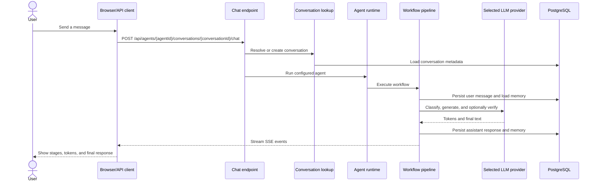

Use `NEW_CONVERSATION` as the `conversationId` path value to create a conversation on the first chat request.

### Admin Function

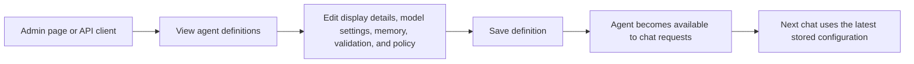

Agent definitions are grouped by objective:

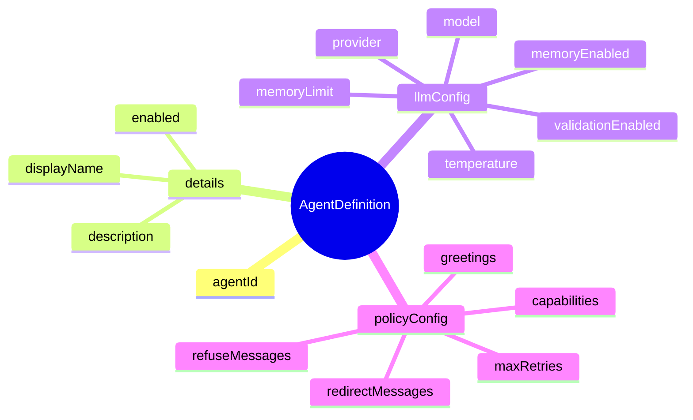

### Persistence Function

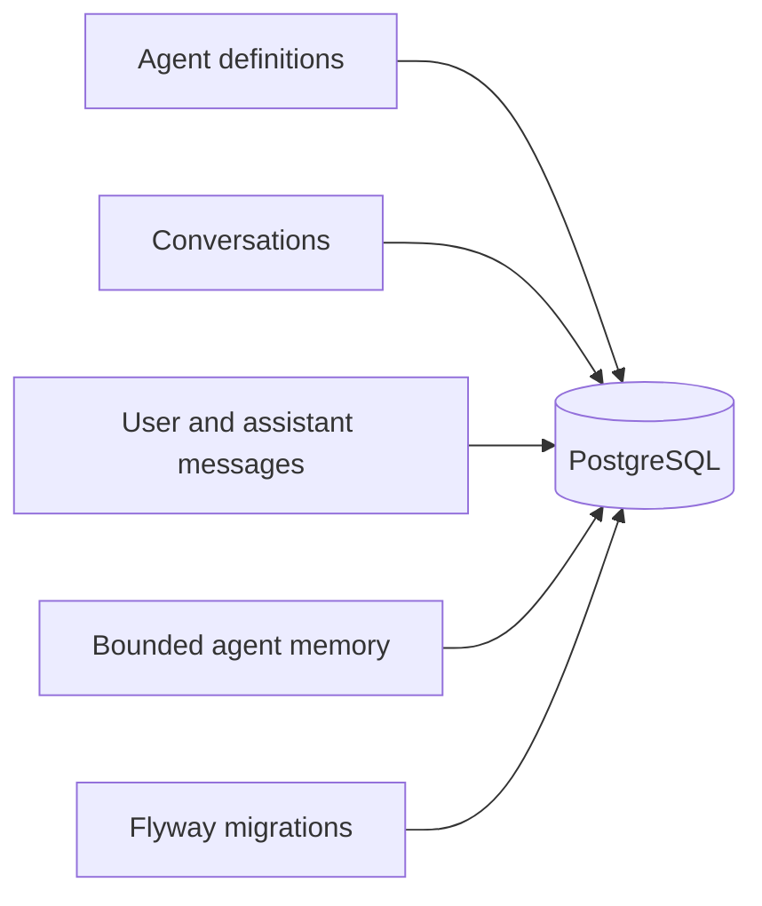

Persistence areas:

- `agents`: editable agent definitions, LLM configuration, and workflow policy configuration.
- `conversation`: conversations grouped by agent.
- `messages`: user and assistant messages per conversation.
- `agentmemory`: bounded memory entries per agent/conversation.

### Provider Function

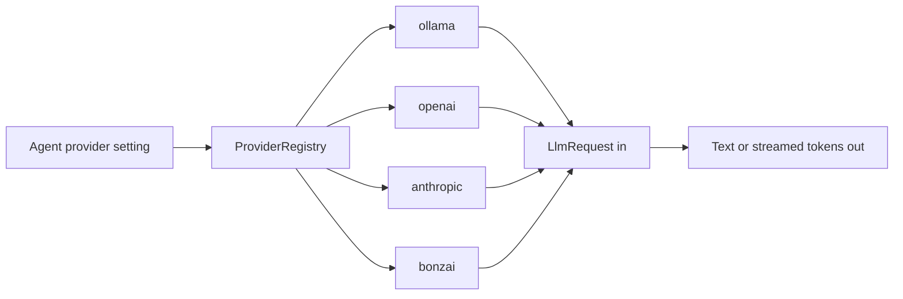

Provider implementations hide SDK and API details. The workflow only needs a provider name, model, temperature, prompt,
history, generated text, and streamed tokens.

---

## Workflow Pipeline

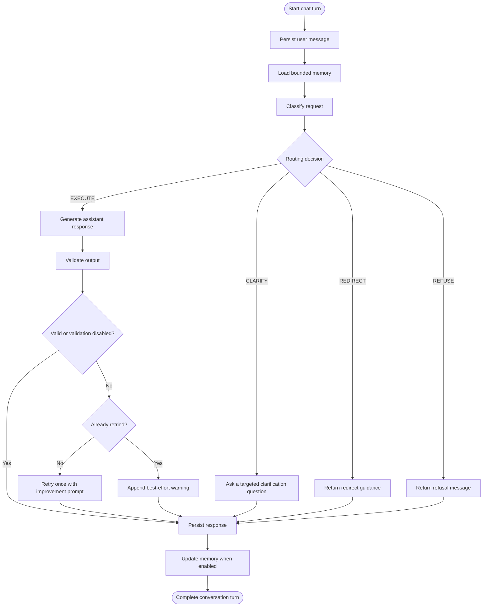

Important domain types behind the pipeline:

- `WorkflowPolicy`: supported capabilities, greetings, refusal messages, redirect messages, and retry limits.
- `WorkflowPrompts`: classification, clarification, and retry prompt construction.
- `ResponseValidationPolicy`: accept current output, retry once, or return best-effort output with a warning.
- `RoutingDecision`: structured classification result.
- `DecisionMode`: `EXECUTE`, `CLARIFY`, `REDIRECT`, `REFUSE`.
- `PipelineEvent`: observable stage, token, decision, memory, completion, and error events.

---

## API

### Agent and Conversation API

```text
GET    /api/agents
GET    /api/agents/{agentId}
GET    /api/agents/{agentId}/conversations
DELETE /api/agents/{agentId}/conversations/{conversationId}
GET    /api/agents/{agentId}/conversations/{conversationId}/messages
POST   /api/agents/{agentId}/conversations/{conversationId}/chat
```

Chat body:

```json
{
  "message": "Write a user story for password reset."
}
```

New conversation route:

```text
POST /api/agents/{agentId}/conversations/NEW_CONVERSATION/chat
```

### Chat SSE Events

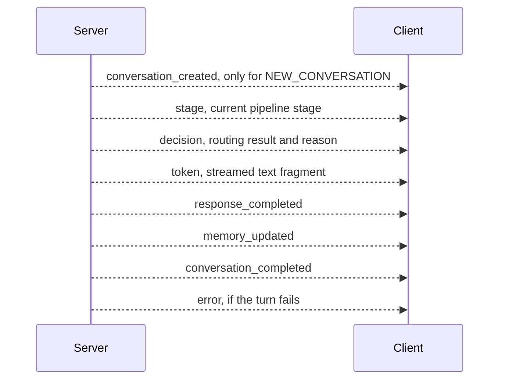

### Admin API

```text
GET    /api/admin/agents/providers
GET    /api/admin/agents
GET    /api/admin/agents/{agentId}
POST   /api/admin/agents
PUT    /api/admin/agents/{agentId}
DELETE /api/admin/agents/{agentId}
```

Admin update example:

```json
{
  "agentId": "6ca207fa-30be-43f0-b4b3-a7e2a1ea650e",
  "details": {
    "displayName": "Product Owner Agent",
    "description": "Turns product requests into user stories and acceptance criteria.",
    "enabled": true
  },
  "llmConfig": {
    "provider": "ollama",
    "model": "mistral",
    "temperature": 0.4,
    "memoryEnabled": true,
    "validationEnabled": true,
    "memoryLimit": 7
  },
  "policyConfig": {
    "capabilities": [
      "user stories",
      "acceptance criteria",
      "release notes"
    ],
    "greetings": [
      "Tell me what product outcome you want to shape."
    ],
    "refuseMessages": [
      "I can only help with product workflow tasks."
    ],
    "redirectMessages": [
      "I can help if we narrow this to product planning or delivery."
    ],
    "maxRetries": 2
  }
}
```

---

## Setup

### Prerequisites

- Java 25.
- Docker for PostgreSQL.
- At least one configured LLM provider.
- Optional: Ollama running locally if you want a fully local provider.

### Start PostgreSQL

```bash
docker compose -f docker/docker-compose.yml up -d
```

The compose file starts the database used by Spring Boot and Flyway. Flyway creates the `agents`, `conversation`,
`messages`, and `agentmemory` tables when the application starts.

### Configure a provider

Main configuration file: `src/main/resources/application.yml`.

```yaml
langchain4j:
  providers:
    ollama:
      base-url: ${OLLAMA_BASE_URL:http://localhost:11434}
      default-model: mistral
      temperature: 0.7
    openai:
      base-url: ${OPENAI_BASE_URL:https://api.openai.com/v1}
      api-key: ${OPENAI_API_KEY:not-configured}
      default-model: gpt-4o-mini
      temperature: 0.7
    anthropic:
      api-key: ${ANTHROPIC_API_KEY:not-configured}
      default-model: claude-haiku-4-5-20251001
      temperature: 0.7

workflow-ai:
  providers:
    bonzai:
      base-url: ${BONZAI_BASE_URL:https://api-v2.bonzai.iodigital.com}
      api-key: ${BONZAI_KEY:not-configured}
      model: gemini-3.1-flash-image-preview
      temperature: 0.7
```

Provider requirements:

| Provider    | Required environment       | Notes                                                                                 |
|-------------|----------------------------|---------------------------------------------------------------------------------------|
| `ollama`    | `OLLAMA_BASE_URL` optional | Defaults to `http://localhost:11434`. Make sure the selected model is pulled locally. |
| `openai`    | `OPENAI_API_KEY`           | `OPENAI_BASE_URL` is optional for compatible endpoints.                               |
| `anthropic` | `ANTHROPIC_API_KEY`        | Uses the configured default model unless an agent overrides it.                       |
| `bonzai`    | `BONZAI_KEY`               | `BONZAI_BASE_URL` is optional.                                                        |

### Start the application

```bash
./gradlew bootRun
```

Open:

```text
http://localhost:8080
```

Static UI entry points:

```text
/            landing page from index.html
/chat.html   chat UI
/admin.html  agent administration UI
```

### Quick local smoke flow

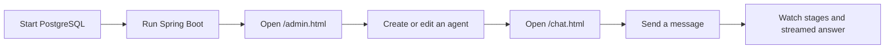

---

## Adding Agents

For most use cases, add an agent through `admin.html` or the admin API. This creates or updates the runtime
configuration stored in PostgreSQL:

- choose a stable `agentId` UUID;
- set display name, description, and enabled flag;
- choose provider, model, temperature, memory, validation, and memory limit;
- define capabilities that classification should consider in scope;
- define greeting, refusal, and redirect messages;
- choose `maxRetries` for workflow retry behavior.

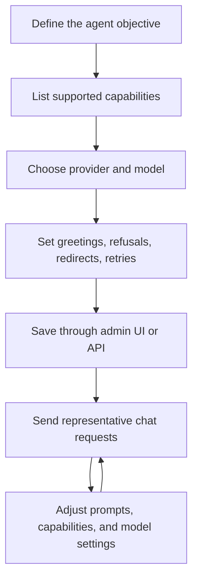

Public REST routes use UUID path variables for chat and admin operations. Keep a stable UUID for each objective so
existing conversations and stored memory stay connected to the same agent.

### Agent design checklist

- Keep the objective narrow enough that classification can confidently choose `EXECUTE`, `CLARIFY`, `REDIRECT`, or
  `REFUSE`.
- Write capabilities as phrases users will naturally ask for.
- Use refusal messages for fully out-of-scope requests.
- Use redirect messages for mixed requests that contain both supported and unsupported work.
- Enable memory for agents that benefit from conversation context.
- Enable validation for agents where answer quality is more important than one extra LLM call.
- Test happy-path, unclear, out-of-scope, and mixed-scope prompts before considering an agent ready.

---

## Possible Use Cases

Workflow AI is useful when an organization wants a controlled, auditable AI assistant with explicit boundaries instead
of a generic open-ended chat bot.

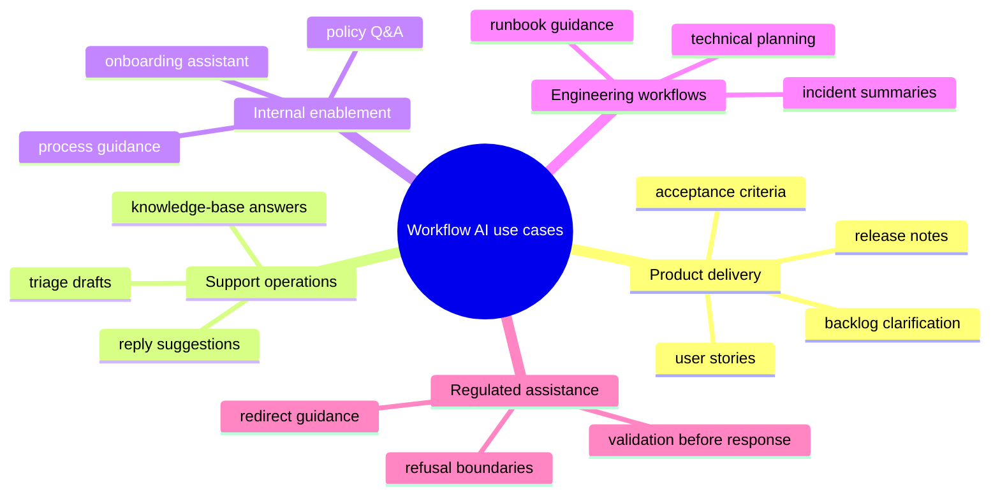

Good fits:

- role-specific assistants with clear capabilities;
- internal copilots that need persistent conversations and memory;
- workflows where requests must be classified before execution;
- applications that need provider flexibility without changing core business logic;
- teams experimenting with local and hosted models behind one API.

Poor fits:

- fully autonomous systems that need tool execution beyond LLM calls;
- anonymous public chat without rate limiting, auth, or abuse controls;
- agents whose scope cannot be described with clear capabilities and refusal rules.

---

## Testing

```bash
./gradlew test
```

Current test areas:

```text
ArchitectureTest              hexagonal dependency rules
AgentAdminEndpointTest        admin endpoint and grouped editable JSON config
ChatEndpointTest              chat endpoint behavior
ConversationPersistenceTest   conversation persistence
MemoryPersistenceTest         memory persistence
SseStreamingTest              streaming behavior
```

Integration tests use Testcontainers for PostgreSQL.

---

## Design Notes

- Keep domain workflow rules free from Spring, JPA, REST, and provider SDK details.
- Keep application services focused on orchestration and port usage.
- Keep adapter code at the edges: REST controllers, DTO mapping, database entities, repositories, provider
  implementations, and static UI.
- Use one stored `AgentDefinition` per objective rather than creating many tiny Java classes.
- Update this README whenever package boundaries, endpoints, workflow stages, providers, or configuration names change.
