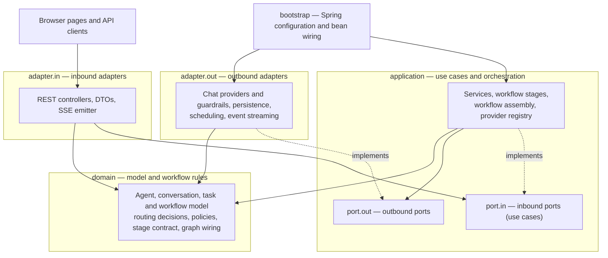
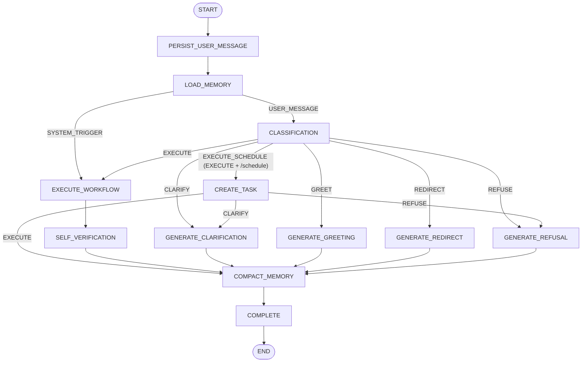
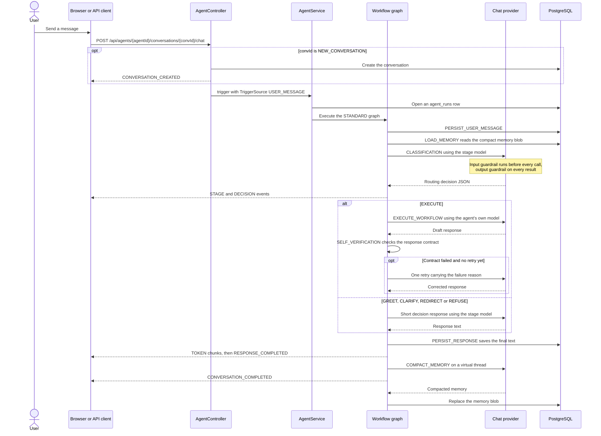
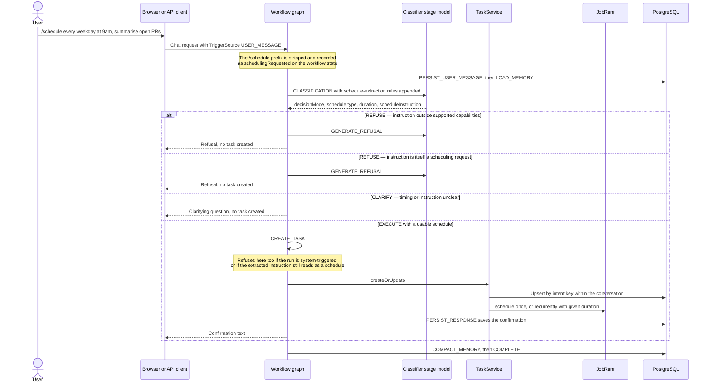
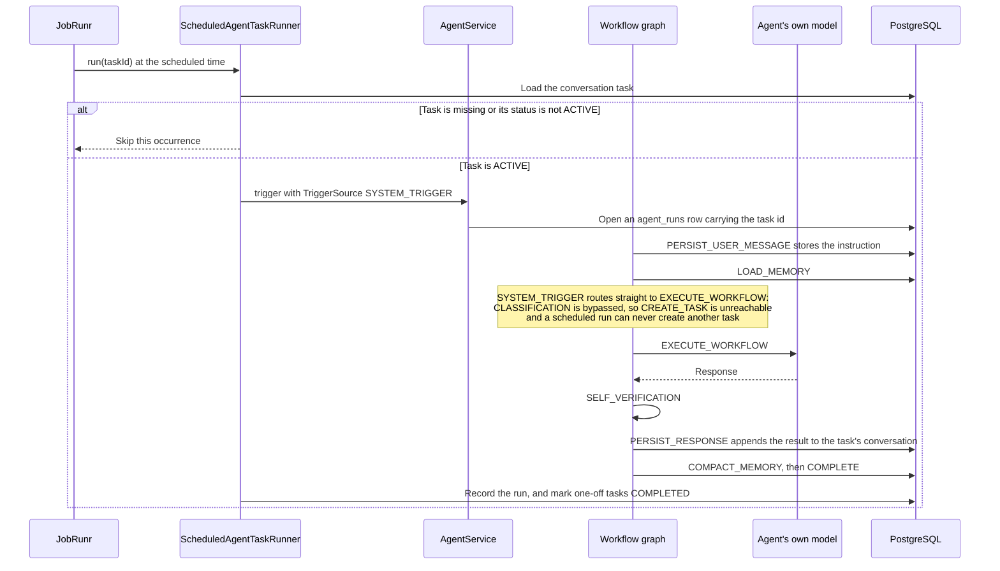

# Workflow AI

## Introduction

Workflow AI is a platform for building scoped, predictable agents. Every agent runs a fixed graph: the request is
classified first, then routed to exactly one generation path, then verified, persisted, and returned. The set of things
an agent can do with a request is enumerable before the request arrives: execute, schedule a task, clarify, greet,
redirect, or refuse. Nothing in the graph lets a model choose its own control flow.

Each step of that graph can use a different model. Classification, clarification, greeting, redirect, refusal, and
memory compaction are configured per stage via `application.yml` and typically point at a small local model. The agent's
own configured model is used only for the work the agent exists to do. Model choice per stage is a configuration value,
not an emergent property of a prompt.

The trade-off is deliberate. Unscoped agent frameworks let a single model decide what to do next, which tool to call,
and when to stop. That is more flexible and much harder to reason about. Here the shape is fixed, the possible outcomes
are known, the cost profile is knowable in advance, and adding a capability means changing code or configuration rather
than hoping a prompt generalises.

This is for experimentation purposes only. It is not intended to be deployed while building it. There is no
authentication, provider keys, or a per-user tenant.

### How this was built

The project was built with help of Claude Code through prompt-driven iteration, with a minimal upfront spec. A review
pass over the whole codebase produced the first spec-like artifact, and after that point development moved to scoped,
ordered implementation prompts. Earlier code therefore reflects unplanned iteration and later code reflects spec-first
prompts. This is a process note, not a claim about quality.

See [SETUP.md](SETUP.md) for prerequisites, installation, running the application, and running the tests.

---

## Core Concepts & Terminology

**Agent**: a database-backed definition (`AgentDefinition`) holding display details and an enabled flag, the workflow it
runs, its chat properties (provider, model, temperature, agent prompt, memory on/off), and its workflow policy. It is
the unit an admin edits and the unit a chat request is addressed to.

**Workflow**: a named, fixed graph of stages. `WorkflowId` enumerates the variants; `STANDARD` is the only one today.
`Workflow` is the runnable instance of a variant bound to one agent's properties.

**Workflow policy**: the per-agent constraints applied inside the workflow: the list of supported capabilities used for
routing, the response contract, and the fallback message used when a response cannot be generated.

**Stage**: one step of a workflow. Every stage implements `WorkflowStage`, reads `WorkflowState`, and returns the keys
it wants updated. Each `StageId` is either user-facing (visible to clients over SSE) or infrastructure (server-side
only).

The stages that exist today:

| Stage                    | Graph node         | User facing | Definition                                                                              |
|--------------------------|--------------------|-------------|-----------------------------------------------------------------------------------------|
| `PERSIST_USER_MESSAGE`   | yes                | no          | Stores the incoming message on the conversation.                                        |
| `LOAD_MEMORY`            | yes                | no          | Reads the conversation's compact memory blob when memory is enabled.                    |
| `CLASSIFICATION`         | yes                | yes         | Produces the routing decision; also extracts schedule details for `/schedule` requests. |
| `EXECUTE_WORKFLOW`       | yes                | yes         | Runs the agent's own model against the request.                                         |
| `CREATE_TASK`            | yes                | yes         | Creates or updates the scheduled task for the conversation.                             |
| `GENERATE_CLARIFICATION` | yes                | yes         | Produces a single clarifying question.                                                  |
| `GENERATE_GREETING`      | yes                | yes         | Produces a short greeting stating what the agent can help with.                         |
| `GENERATE_REDIRECT`      | yes                | yes         | Points a mixed-scope request at its in-scope part.                                      |
| `GENERATE_REFUSAL`       | yes                | yes         | Declines an out-of-scope or unsafe request.                                             |
| `SELF_VERIFICATION`      | yes                | yes         | Checks the generated response against the response contract and retries once.           |
| `PERSIST_RESPONSE`       | no — shared helper | no          | Saves the final response and emits it, called by every stage that produces one.         |
| `COMPACT_MEMORY`         | yes                | no          | Rewrites the conversation's memory blob after the visible turn.                         |
| `COMPLETE`               | yes                | yes         | Closes the turn and hands the result to notification channels.                          |
| `GUARDRAIL_INPUT`        | no                 | no          | Declared with a label but never emitted; guardrailing happens inside the provider call. |
| `GUARDRAIL_OUTPUT`       | no                 | no          | Declared with a label but never emitted; guardrailing happens inside the provider call. |

**DecisionMode**: the routing verdict a request is reduced to: `GREET`, `EXECUTE`, `EXECUTE_SCHEDULE`, `CLARIFY`,
`REDIRECT`, `REFUSE`. The classifier only ever returns the other five; `EXECUTE_SCHEDULE` is derived in the graph when
an `EXECUTE` decision coincides with a scheduling request.

**Response contract**: what a valid generated response must look like: free text or JSON, an optional minimum length,
and for JSON an optional list of required top-level fields.

**Memory**: one compact text blob per `(conversation, agent)` pair, loaded into the model's system prompt and rewritten
after the visible turn completes.

**ConversationTask**: a standing instruction attached to one `(agent, conversation)` pair: the instruction to run, an
intent key used to deduplicate it, a schedule type (`ONCE`, `RECURRING`), a duration `PT5M`, a status (`ACTIVE`,
`PAUSED`, `COMPLETED`, `CANCELLED`), and last-run information.

**TriggerSource**: who started a run. `USER_MESSAGE` means a person sent a chat message. `SYSTEM_TRIGGER` means the
scheduler fired a `ConversationTask`. The two enter the graph at different points.

**Agent run**: one execution of a workflow, recorded with its trigger source, optional task id, timestamps, final
status, and failure message.

**Chat provider**: an adapter that can call one model family, selected per agent and per stage by id (`Anthropic`,
`Bonzai`, `Ollama`, `OpenAI`).

---

## Architecture

The code follows hexagonal architecture best practices. The domain holds the model and the workflow definition and
rules, the application layer owns the ports, execution, and the orchestration, and adapters sit on the outside
implementing those ports.



Dependencies only ever point inward, and the inbound and outbound adapter packages never reference each other.
`ArchitectureTest` enforces this as a test rather than a convention. Domain may not depend on the application layer, on
adapters, on Spring, or on LangChain4j. The application layer may not depend on adapters or on either AI framework.
LangChain4j is confined to `adapter.out.chat`. LangGraph4j is confined to `domain.workflow`.

The concrete package and file layout are in [SETUP.md](SETUP.md).

### The compiled workflow graph

This is the `STANDARD` graph as wired in `WorkflowExecutorFactory`, which is the only graph the application can build
today.



Three details of the graph are worth stating because the diagram alone can mislead:

- There is no separate schedule-extraction node. When a message starts with `/schedule`, the prefix is stripped, a
  `schedulingRequested` flag is set on the state, and `CLASSIFICATION` runs with schedule-extraction rules appended to
  its prompt, returning the schedule type and duration alongside the decision.
- `PERSIST_RESPONSE` is not a node. It is a helper that every terminal stage calls, so the response is saved before any
  of it is emitted.
- `CREATE_TASK` can re-route. It re-enters `GENERATE_CLARIFICATION` or `GENERATE_REFUSAL` when the extracted schedule
  cannot be used, which is why those two nodes have inbound edges from two places.

Three frameworks carry most of the weight, and each one is confined to a single concern. LangChain4j provides the
per-provider chat and streaming chat models and the input/output guardrail interfaces, which is why guard railing
happens at the provider boundary rather than as its own stage. LangGraph4j compiles the stage graph and executes it and
also renders it as Mermaid, which is how the admin UI stays in sync with the real graph rather than a drawing of it.
JobRunr runs the scheduled tasks, storing their own state in the same PostgreSQL instance under a separate schema. The
full technology list lives in [SETUP.md](SETUP.md).

---

## Main Functions & Execution Flows

### Chat

A user message enters through the chat endpoint, is classified, routed to exactly one generation path, verified,
persisted, and streamed back. The response is saved before the first token is emitted, so a dropped SSE connection never
loses the answer.



Details the diagram compresses:

- Use `NEW_CONVERSATION` as the conversation path value to create the conversation on the first request.
- `GENERATE_CLARIFICATION` calls a model only when the classifier did not already supply a clarification question.
- If the input guardrail blocks the request inside `EXECUTE_WORKFLOW`, the stage short-circuits to the agent's fallback
  message instead of retrying, because a retry would hit the same block.
- `SELF_VERIFICATION` retries at most once. A response that is still invalid afterwards is persisted and returned
  anyway, with a `STAGE` event carrying `FAILED`.
- Memory compaction runs on a virtual thread and never blocks the turn. It is skipped when the agent has memory disabled
  or produced an empty response.

### Schedule creation

A message prefixed with `/schedule` asks the agent to keep doing something. The prefix is stripped before the message
reaches the model, `CLASSIFICATION` extracts the timing and the instruction, and `CREATE_TASK` upserts the task and
confirms it. Two conditions refuse outright: an instruction outside the agent's supported capabilities, and an
instruction that is itself a request to schedule something.



The capability check happens here, once, and not again when the task fires — the classification rules say so explicitly,
because the stored instruction will be re-run without further review. The recursion check is applied twice: the
classifier is told to refuse an instruction that schedules something, and `CREATE_TASK` independently re-checks the
extracted instruction and refuses a blank one or one that still reads as a scheduling request.

Repeating the same `/schedule` request does not accumulate tasks. The instruction is hashed into an intent key, and a
matching key within the same conversation updates the existing task and reschedules it.

### Scheduled execution

When JobRunr fires, the task's instruction is replayed through the same graph, entering at a different point.



Two consequences of bypassing classification are worth being explicit about. The run's capability scope is not
re-checked at fire time; the only gate is that the task is still `ACTIVE`, and scope was settled when the task was
created. And `CREATE_TASK` is unreachable on this path, so a scheduled run cannot schedule anything — belt and braces,
since `CREATE_TASK` also refuses system-triggered runs if it is ever reached another way. Guardrails still apply because
they live in the provider call: blocked input makes `EXECUTE_WORKFLOW` return the agent's fallback message.

The result is visible in the conversation the task belongs to. `NotificationChannel` exists as a port for pushing it
somewhere else, but has no implementation yet.

### Admin

`admin.html` edits `AgentDefinition` records through the admin API. One agent is selected from the list on the left, and
its properties are split across three tabs, all saved together by the single form:

- **Overview** — reads and writes `details`: the enabled flag, display name, and description. The agent id is shown
  read-only.
- **Instructions & Policy** — reads and writes `chatProperties.agentPrompt` and the whole of `workflowPolicy`:
  supported capabilities, the failed-to-process fallback, and the response contract (format, minimum length, and
  required JSON fields when the format is JSON).
- **Workflow** — reads and writes `workflowId` and the rest of `chatProperties`: chat provider, model, temperature, and
  the memory flag. The provider and model dropdowns are populated from
  `GET /api/admin/agents/supported-chat-providers`, and the model list is filtered by the selected provider. Below the
  fields, the agent's compiled graph is fetched as Mermaid text and rendered.

Two things the admin UI does not do. Per-stage model tiering is not editable there: the stage models live in
`workflow-ai.stages` in `application.yml` and require a restart. And scheduled tasks are managed from the chat UI, not
here — `chat.html` has a **Tasks** tab listing the current conversation's tasks with their schedule, status, next run,
and last run, and offering pause, resume, and cancel.

Agents are not cached. Each request rebuilds the agent from its stored definition, so a saved edit takes effect on the
next request without a reload step.

### Adapters

Adding a model provider is the extension point a contributor is most likely to touch. A provider is one class in
`adapter.out.chat.provider` implementing the `ChatProvider` outbound port, which is deliberately small: an id, a
buffered `call`, a token-consuming `stream`, and the set of models it supports.

Most of the work is already shared. `AbstractChatProvider` builds the message list, applies the input guardrail before
the call and the output guardrail to the result, falls back to the provider's default model when a requested model is
not supported, and turns LangChain4j's streaming callbacks into a synchronous call that returns the full text.
`AbstractOpenAiProvider` adds a complete implementation for any OpenAI-compatible endpoint: `OpenAiProvider`
and `BonzaiProvider` both build on it, and Bonzai adds nothing beyond its own configuration record.
`OllamaProvider` and `AnthropicProvider` extend `AbstractChatProvider` directly because their model builders differ;
`OllamaProvider` additionally checks `/api/tags` and fails with instructions to pull the missing model.

To add one: add a value to `ChatProviderId`, add a `@Component` extending `AbstractOpenAiProvider` for an
OpenAI-compatible endpoint or `AbstractChatProvider` otherwise, give it a nested `@ConfigurationProperties` record with
base URL, key, default model, default temperature, and supported models, and add the matching block to
`application.yml` — note that the existing providers are split between `langchain4j.*` and, for Bonzai,
`workflow-ai.providers.bonzai`, so follow whichever prefix your record declares. `ChatProviderRegistry` collects every
`ChatProvider` bean by id, so nothing needs registering by hand; the new provider immediately appears in the admin
dropdowns and can be selected per agent and per stage.

---

## APIs & SSE Events

### Agents and chat API

```text
GET    /api/agents
GET    /api/agents/{agentId}
GET    /api/agents/{agentId}/conversations
DELETE /api/agents/{agentId}/conversations/{conversationId}
GET    /api/agents/{agentId}/conversations/{conversationId}/messages
POST   /api/agents/{agentId}/conversations/{convId}/chat
GET    /api/agents/{agentId}/conversations/{conversationId}/tasks
POST   /api/agents/{agentId}/conversations/{conversationId}/tasks/{taskId}/pause
POST   /api/agents/{agentId}/conversations/{conversationId}/tasks/{taskId}/resume
POST   /api/agents/{agentId}/conversations/{conversationId}/tasks/{taskId}/cancel
```

`POST .../chat` takes `{"message": "..."}` and responds with `text/event-stream`:

```bash
curl -N -X POST http://localhost:8080/api/agents/$AGENT_ID/conversations/NEW_CONVERSATION/chat \
  -H 'Content-Type: application/json' \
  -d '{"message": "Write a user story for password reset."}'
```

### Admin API

```text
GET    /api/admin/agents/supported-chat-providers
GET    /api/admin/agents
GET    /api/admin/agents/{agentId}
GET    /api/admin/agents/{agentId}/workflowDiagram
POST   /api/admin/agents
PUT    /api/admin/agents/{agentId}
DELETE /api/admin/agents/{agentId}
```

`POST` and `PUT` take a full `AgentDefinition`. `PUT` ignores the body's `agentId` in favour of the path value.
`workflowDiagram` returns Mermaid text as `text/plain`.

```json
{
  "agentId": "6ca207fa-30be-43f0-b4b3-a7e2a1ea650e",
  "workflowId": "STANDARD",
  "details": {
    "displayName": "Product Owner Agent",
    "description": "Turns product requests into user stories and acceptance criteria.",
    "enabled": true
  },
  "chatProperties": {
    "providerId": "Ollama",
    "model": "gemma4:26b",
    "agentPrompt": "You help product teams write scoped user stories.",
    "temperature": 0.4,
    "memoryEnabled": true
  },
  "workflowPolicy": {
    "supportedCapabilities": [
      "user stories",
      "acceptance criteria",
      "release notes"
    ],
    "responseContract": {
      "format": "TEXT",
      "requiredFields": [],
      "minLength": 0
    },
    "fallbackFailedToProcess": "I could not process that safely right now. Please try again with a product-planning request."
  }
}
```

### SSE events

Event names are the `EventType` constants, upper snake case:

| Event                    | Data                                                                               | Sent when                                                         |
|--------------------------|------------------------------------------------------------------------------------|-------------------------------------------------------------------|
| `CONVERSATION_CREATED`   | conversation JSON: `id`, `agentId`, `title`, `createdAt`, `updatedAt`              | Only when the path value was `NEW_CONVERSATION`.                  |
| `STAGE`                  | `{"stageId","status","label","reason"}`, status `STARTED`, `COMPLETED` or `FAILED` | A stage starts, finishes or fails — user-facing stages only.      |
| `DECISION`               | `{"mode","reason"}`                                                                | Classification produced a routing decision.                       |
| `TOKEN`                  | `text/plain` fragment                                                              | Each chunk of the final response.                                 |
| `RESPONSE_COMPLETED`     | `{}`                                                                               | The response text is complete.                                    |
| `CONVERSATION_COMPLETED` | `{}`                                                                               | The visible turn is finished.                                     |
| `MEMORY_UPDATED`         | `{}`                                                                               | Defined end to end but never emitted — see the limitations below. |
| `ERROR`                  | `{"message"}`                                                                      | The turn failed.                                                  |

Infrastructure stages (`PERSIST_USER_MESSAGE`, `LOAD_MEMORY`, `PERSIST_RESPONSE`, `COMPACT_MEMORY`) are logged
server-side but never streamed. `TOKEN` events are whitespace-split chunks of a response that is already complete and
already persisted, not model-paced output.

---

## Known Limitations & Chosen Scope

### Not yet implemented

- **Responses are not streamed as they are generated.** `EXECUTE_WORKFLOW` and the greeting, redirect, and refusal
  stages pass a discarding token consumer to the provider and buffer the whole response — `EXECUTE_WORKFLOW` has to,
  because `SELF_VERIFICATION` may reject the draft. Clarification does not stream at all. `PERSIST_RESPONSE` then
  re-emits the finished text as `TOKEN` events. The SSE contract is streaming; the experience is a burst.
- **`MEMORY_UPDATED` is never emitted.** The event exists as `WorkflowEvent.MemoryUpdated`, as an `EventType`, as a
  controller branch and as a handler in `chat.js`, but `WorkflowEventStreamer` has no method that produces it.
- **Guardrail stages are never emitted.** `GUARDRAIL_INPUT` and `GUARDRAIL_OUTPUT` have ids and UI labels, but
  guardrailing happens inside the provider call, so clients never see a guardrail step.
- **Notifications go nowhere.** `NotificationChannel` has no implementation, so `COMPLETE`'s fan-out is a no-op and a
  scheduled result is only visible in its conversation.
- **Schedule validation leans entirely on the classifier prompt.** `CREATE_TASK` routes to `CLARIFY` on
  `InvalidScheduleException` and to `REFUSE` on `ScheduleTooFrequentException`. A malformed duration expression or
  `runOnceAt` value that gets past the model fails the run instead of being clarified.
- **Memory compaction can race the next turn.** Compaction runs on a virtual thread after the response is emitted, so a
  fast follow-up message may load the previous memory blob.
- **Self-verification gives up after one retry.** A response that is still invalid is persisted and returned as best
  effort.
- **Agents are rebuilt per request.** Every call re-reads the definition, re-validates the provider and models, and
  recompiles the graph. This is what makes admin edits take effect immediately, and it repeats work on every turn.
- **Task control ignores its own path parameters.** `pause`, `resume` and `cancel` take `agentId` and
  `conversationId` in the path but act on `taskId` alone, and tasks can only be listed per conversation.

### Intentionally out of scope

These are decisions, not a backlog.

- **More workflows and stages.** `WorkflowId` has one value and `WorkflowExecutorFactory` builds one graph. New variants
  and stages get added when a real requirement needs them, not speculatively — and the graph is intentionally not
  user-editable, since a fixed, inspectable shape is the point of the project.
- **Multi-tenancy, agent ACLs, and user management.** There is no user in the model at all: conversations belong to
  agents. Adding identity, ownership, and per-agent access control would change the data model throughout, and this tool
  has no use for it.
- **Hosting local models.** Ollama is consumed as an already-running endpoint through a provider adapter, which checks
  that a model is present and tells you to `ollama pull` it yourself. Managing local inference servers — Ollama, vLLM,
  or anything else — as pluggable provider connections owned by this project is not something it will do; new engines
  arrive as adapters against endpoints someone else runs.
- **Production deployment.** This project is not intended to be deployed. If that ever changed, each of the following
  would need evaluating first, and none of them is a commitment: authentication and authorization on both API surfaces;
  secrets management, since provider keys and the datasource password are plain values in
  `application.yml` today; observability and tracing across stages and model calls; rate limits and cost controls;
  backups and a retention policy for conversations, memory and run history; and multi-tenant data isolation.
