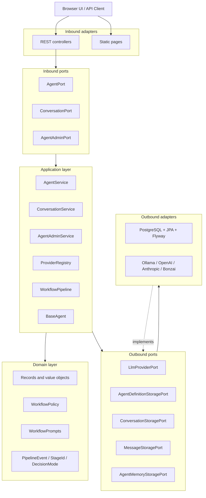
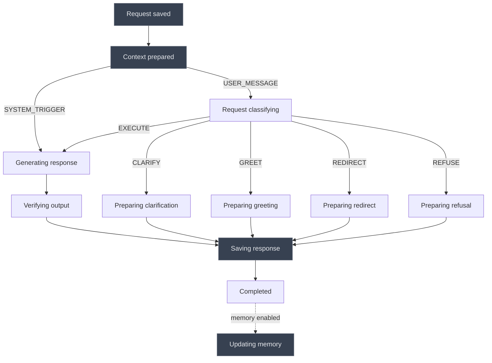
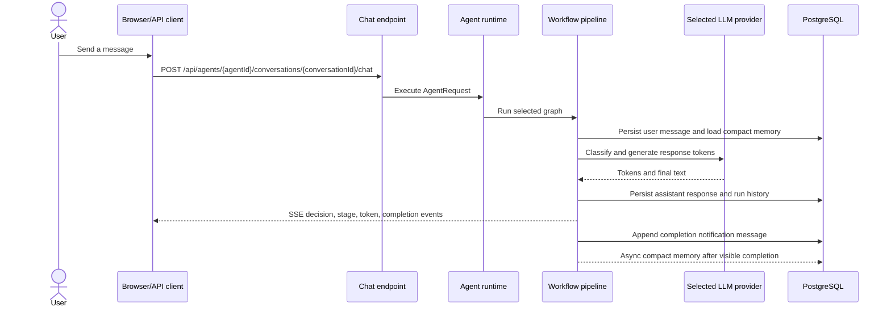

# Workflow AI

Workflow AI is a Spring Boot application for scoped and predictable configurable AI agents. It exposes REST/SSE chat APIs, browser UIs, admin APIs, PostgreSQL/Flyway/JPA persistence, compact per-conversation memory, and pluggable LangChain4j LLM providers.

The runtime intentionally keeps each agent inside a fixed classify -> route -> generate pipeline. Requests are classified before execution; ambiguous, mixed-scope, greeting, and out-of-scope requests have bounded outcomes.

---

## Core Concepts

- **Runtime**: Spring Boot application that hosts configured agents and streams their responses.
- **Agent**: Database-backed definition with display details, LLM settings, capabilities, fallback behavior, and a fixed workflow diagram.
- **Workflow**: Fixed graph with persistence, memory loading, classification, decision-specific generation, verification, response persistence, and async memory compaction.
- **Stage**: Observable workflow step. Server logs every stage; SSE exposes only agent-facing stages.
- **Decision/Routing**: `DecisionMode` values are `EXECUTE`, `CLARIFY`, `GREET`, `REDIRECT`, and `REFUSE`.
- **Memory**: One compact memory blob per `(conversation_id, agent_id)`, loaded into `LlmRequest.memoryContext` when enabled and refreshed asynchronously after the visible turn completes.
- **LLM Provider**: Adapter selected by provider/model configuration; supports full calls and token streaming.

---

## Architecture



`ArchitectureTest` enforces the hexagonal dependency rules.

---

## Execution Lifecycle



The same declared edge list is also exposed to the admin UI as Mermaid text through each agent's `workflowDiagram` field.

---

## Main Functions

### Chat Function



Use `NEW_CONVERSATION` as the `conversationId` path value to create a conversation on the first chat request.
`SYSTEM_TRIGGER` exists only as an internal `AgentRequest` entry point for future unattended runs; there is no public scheduler or trigger API yet.

### Admin Function

Admin pages and APIs manage `AgentDefinition` records. Runtime agents are cached; after editing an agent, reload it before expecting chat requests to use the new settings.

### Persistence

- `agents`: editable agent definitions with JSON `details`, `llm_config`, and `policy_config`.
- `conversations`: conversation metadata per agent.
- `messages`: user and assistant messages.
- `agent_memory`: one compact memory blob per `(conversation_id, agent_id)`.
- `agent_runs`: one row per pipeline execution with trigger source, timestamps, final status, and optional failure details.

---

## Agents API

```text
GET    /api/agents
GET    /api/agents/{agentId}
GET    /api/agents/{agentId}/reload
GET    /api/agents/{agentId}/conversations
DELETE /api/agents/{agentId}/conversations/{conversationId}
GET    /api/agents/{agentId}/conversations/{conversationId}/messages
POST   /api/agents/{agentId}/conversations/{conversationId}/chat
```

Chat body:

```json
{
  "message": "Write a user story for password reset."
}
```

### Chat SSE Events

- `CONVERSATION_CREATED`: sent only for `NEW_CONVERSATION`.
- `stage`: sent only for agent-facing stages; infrastructure stages such as request save, memory load, response persistence, and memory compaction are not streamed.
- `decision`: routing mode and reason.
- `token`: streamed text fragment.
- `RESPONSE_COMPLETED`: final response text is complete.
- `CONVERSATION_COMPLETED`: user-visible turn is complete.
- `error`: turn failure.

---

## Admin API

```text
GET    /api/admin/agents/providers
GET    /api/admin/agents
GET    /api/admin/agents/{agentId}
POST   /api/admin/agents
PUT    /api/admin/agents/{agentId}
DELETE /api/admin/agents/{agentId}
```

Admin update example:

```json
{
  "agentId": "6ca207fa-30be-43f0-b4b3-a7e2a1ea650e",
  "details": {
    "displayName": "Product Owner Agent",
    "description": "Turns product requests into user stories and acceptance criteria.",
    "enabled": true
  },
  "llmConfig": {
    "providerId": "Ollama",
    "model": "mistral",
    "agentPrompt": "You help product teams write scoped user stories.",
    "temperature": 0.4,
    "memoryEnabled": true
  },
  "workflowPolicyProperties": {
    "supportedCapabilities": ["user stories", "acceptance criteria", "release notes"],
    "fallbackFailedToProcess": "I could not process that safely right now. Please try again with a product-planning request."
  }
}
```

---

## Package Structure

```text
src/main/java/io/workflowai
├── domain
│   ├── agents
│   ├── exceptions
│   ├── model
│   └── workflow
├── application
│   ├── AgentService.java
│   ├── AgentAdminService.java
│   ├── ConversationService.java
│   ├── ProviderRegistry.java
│   ├── agents
│   └── pipeline
├── ports
│   ├── inbound
│   └── outbound
└── adapters
    ├── inbound/rest
    └── outbound
        ├── persistence
        └── providers
```

---

## Technologies / Tools

- Java 25 and Spring Boot.
- LangGraph4j for the fixed workflow graph.
- LangChain4j for provider integrations.
- PostgreSQL, Flyway, JPA, and Testcontainers.
- Plain HTML/CSS/JavaScript frontend with Mermaid for the read-only workflow viewer.

---

## Known Limitations & Near-Term Roadmap

- Admin edits require agent reload/cache refresh before runtime chats use the new definition.
- Async memory compaction can race with an immediate next turn; the next turn may load the previous compacted memory.
- Agent-to-agent delegation is not implemented.
- The workflow shape is intentionally fixed and linear with a classification branch; there is no editable workflow builder.
- Scheduled or triggered unattended agent runs are planned but not implemented.

---

## Setup / Testing

Start PostgreSQL:

```bash
docker compose -f docker/docker-compose.yml up -d
```

Run the application:

```bash
./gradlew bootRun
```

Open:

```text
http://localhost:8080
/chat.html
/admin.html
```

Run tests:

```bash
./gradlew test
```

Integration tests use Testcontainers for PostgreSQL.
