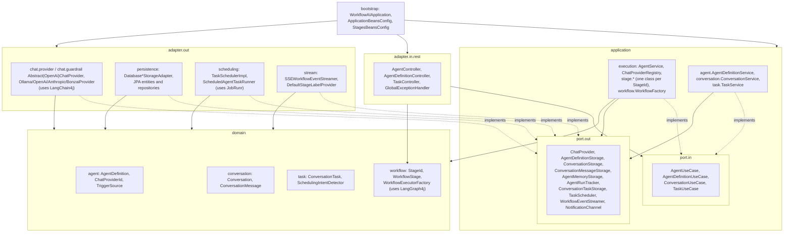
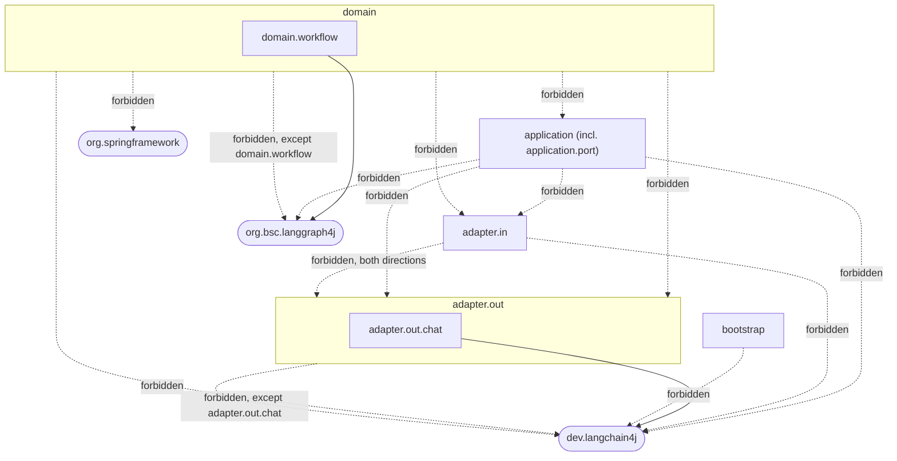
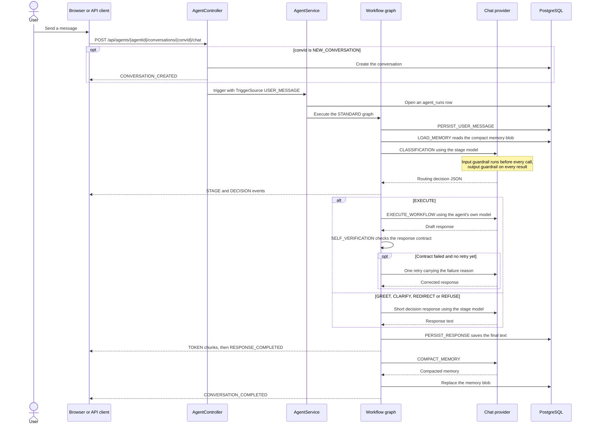
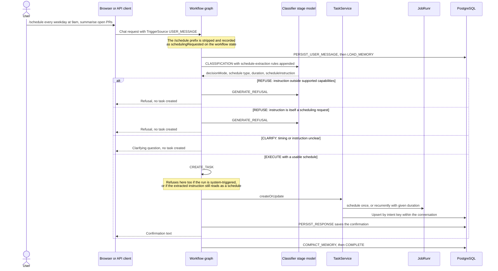
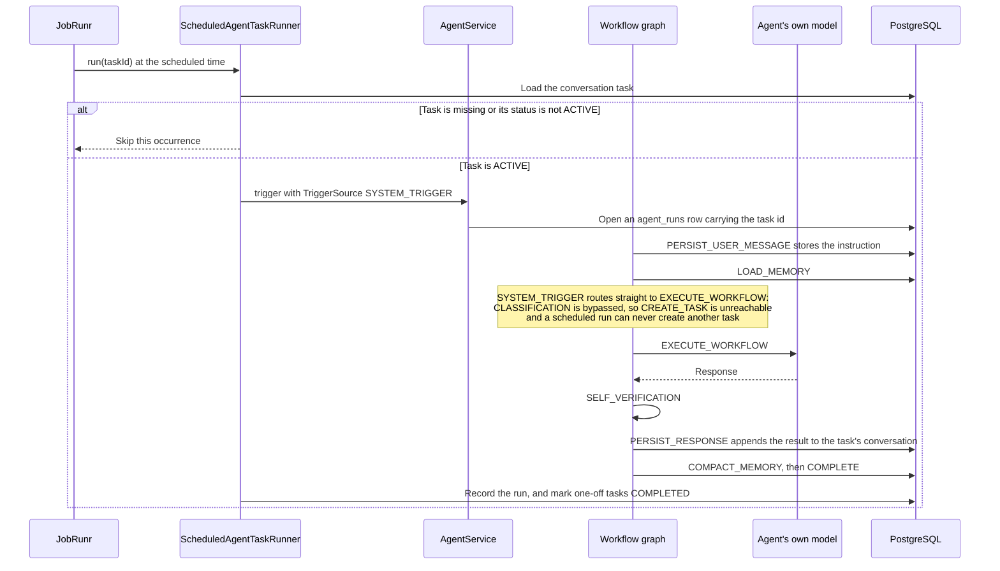

# Workflow AI

## Introduction

Workflow AI is a platform for building scoped, predictable agents. Each agent runs a fixed workflow whose possible routes
are known before a request arrives. A user request is classified as `GREET`, `EXECUTE`, `CLARIFY`, `REDIRECT`, or
`REFUSE`. A scheduling request can route an `EXECUTE` decision through task creation. A scheduled run enters the same
workflow at execution and cannot create another task.

The workflow controls routing, retries, persistence, and completion. Models generate decisions and text, but they do not
choose the next stage or decide when the workflow stops. Classification and the short response stages can use smaller
models, while the agent's configured model handles its main work.

[SETUP.md](SETUP.md) owns the technology inventory, package layout, database tables, prerequisites, configuration, run
commands, and test instructions.

> This project is a **PoC** to demonstrate that fixed control flow can make agent behaviour, cost, and failure handling easier to inspect. It is not **production-ready**. See [Known limitations and scope](#known-limitations-and-scope).

## Specs

The files under [`spec`](spec) define the detailed behaviour and acceptance criteria. This README describes the system as
a whole.

- Agent definition and run lifecycle: [`spec/agent`](spec/agent)
- Guardrails: [`spec/guardrails`](spec/guardrails)
- Workflow stages: [`spec/stages`](spec/stages)
- Workflow routing: [STANDARD workflow](spec/workflow/StandardWorkflow.md)
- Scheduled tasks: [`spec/task`](spec/task)
- SSE delivery: [`spec/sse`](spec/sse)
- Completion notifications: [notification contract](spec/notification/NotificationChannels.md)

## Core concepts

**Agent:** is the unit selected by a chat request and edited by an administrator. Its definition contains display
details, enabled state, workflow, provider and model settings, system instructions, memory setting, and workflow policy.

**Workflow:** is a named fixed graph of stages. `STANDARD` is the supported workflow mode.

**Workflow policy:** contains the agent's supported capabilities, response contract, and fallback message.

**Stage:** is one step in the workflow. A user-facing stage produces SSE progress events. Internal stages remain hidden
from clients.

| Stage                    | In graph | User facing | Behavior                                                                  | Specification                                                       |
|--------------------------|----------|-------------|---------------------------------------------------------------------------|---------------------------------------------------------------------|
| `PERSIST_USER_MESSAGE`   | yes      | no          | Stores the triggering message with its user or system role.               | [UserMessagePersistence](spec/stages/UserMessagePersistence.md)     |
| `LOAD_MEMORY`            | yes      | no          | Loads compact conversation memory when enabled.                           | [MemoryLoading](spec/stages/MemoryLoading.md)                       |
| `CLASSIFICATION`         | yes      | yes         | Chooses a route and extracts requested schedule details.                  | [Classification](spec/stages/Classification.md)                     |
| `EXECUTE_WORKFLOW`       | yes      | yes         | Generates and validates the agent's draft response.                       | [ExecuteWorkflow](spec/stages/ExecuteWorkflow.md)                   |
| `CREATE_TASK`            | yes      | yes         | Creates or updates a scheduled task, or returns clarification or refusal. | [SchedulingTasks](spec/stages/SchedulingTasks.md)                   |
| `GENERATE_CLARIFICATION` | yes      | yes         | Produces one clarifying question.                                         | [ClarificationResponse](spec/stages/ClarificationResponse.md)       |
| `GENERATE_GREETING`      | yes      | yes         | Produces a short in-persona greeting.                                     | [GreetingResponse](spec/stages/GreetingResponse.md)                 |
| `GENERATE_REDIRECT`      | yes      | yes         | Directs a mixed-scope request toward its supported part.                  | [RedirectResponse](spec/stages/RedirectResponse.md)                 |
| `GENERATE_REFUSAL`       | yes      | yes         | Declines an unsafe or out-of-scope request.                               | [RefusalResponse](spec/stages/RefusalResponse.md)                   |
| `SELF_VERIFICATION`      | yes      | yes         | Accepts a valid draft or makes one corrective attempt.                    | [ResponseSelfVerification](spec/stages/ResponseSelfVerification.md) |
| `PERSIST_RESPONSE`       | no       | no          | Saves final text before emitting tokens and response completion.          | Shared response operation                                           |
| `COMPACT_MEMORY`         | yes      | no          | Replaces compact memory after a visible response when enabled.            | [MemoryCompaction](spec/stages/MemoryCompaction.md)                 |
| `COMPLETE`               | yes      | yes         | Signals completion and invokes notification channels.                     | [WorkflowCompletion](spec/stages/WorkflowCompletion.md)             |
| `GUARDRAIL_INPUT`        | no       | no          | Reserved stage identity. Input checks run at the provider boundary.       | [InputGuardrail](spec/guardrails/InputGuardrail.md)                 |
| `GUARDRAIL_OUTPUT`       | no       | no          | Reserved stage identity. Output checks run at the provider boundary.      | [OutputGuardrail](spec/guardrails/OutputGuardrail.md)               |

Greeting, redirect, and refusal share the same fallback rule. A generation failure returns the agent policy's
`failedToProcessMessage` value. See [decision response generation](spec/stages/DecisionResponse.md).

**Decision mode:** is one of `GREET`, `EXECUTE`, `CLARIFY`, `REDIRECT`, or `REFUSE`. `EXECUTE_SCHEDULE` is a graph
routing label derived from `EXECUTE` plus a scheduling request. It is not a classification decision mode.

**Response contract:** defines valid free text or JSON, an optional minimum length, and optional required top-level JSON
fields.

**Memory:** is one compact text value for an agent and conversation. It is loaded before generation and may be replaced
after the visible response.

**Conversation task:** is a standing instruction for an agent and conversation. It has an `ONCE` or `RECURRING`
schedule and an `ACTIVE`, `PAUSED`, `COMPLETED`, or `CANCELLED` status.

**Trigger source:** is `USER_MESSAGE` for a chat request or `SYSTEM_TRIGGER` for a scheduled occurrence. The source
determines which role is persisted and whether classification runs.

**Agent run:** is one workflow execution with its trigger source, optional task identity, timestamps, status, and failure
information.

**Chat provider:** connects one model family. Agents and individual workflow stages select providers independently from
`Anthropic`, `Bonzai`, `Grok`, `Ollama`, or `OpenAI`.

## Architecture

Workflow AI uses a hexagonal structure. The domain owns the model and workflow rules. The application layer owns use
cases, execution, and ports. Inbound and outbound adapters connect HTTP, models, persistence, scheduling, and event
delivery. Bootstrap code assembles those parts. Architecture tests enforce the dependency boundaries.

### Components and boundaries



`bootstrap` is the only area allowed to know about every layer because it assembles the application. Model providers,
database access, scheduling, and SSE delivery remain behind outbound ports.

### Dependency rules

Dashed arrows are forbidden dependencies. Solid arrows are the two narrow framework exceptions.



The domain does not depend on the application, adapters, Spring, or LangChain4j. Only `domain.workflow` may use
LangGraph4j. The application does not depend on adapters or AI frameworks. LangChain4j is confined to outbound chat
adapters, and inbound and outbound adapters do not depend on each other.

### The compiled workflow graph

`STANDARD` is the only supported workflow graph.


Three details are not visible as separate nodes:

- There is no separate schedule-extraction node. `CLASSIFICATION` extracts the schedule type and duration alongside the
  decision when scheduling is requested. See the [classification specification](spec/stages/Classification.md).
- `PERSIST_RESPONSE` is a shared operation used by every response-producing branch. It saves the final response before
  any token or response-completed event is emitted.
- `CREATE_TASK` can re-route into `GENERATE_CLARIFICATION` or `GENERATE_REFUSAL` when the extracted schedule cannot be
  used. See the [workflow specification](spec/workflow/StandardWorkflow.md).

LangChain4j is confined to model access and guardrails. LangGraph4j compiles and renders the graph. JobRunr schedules
conversation tasks. [SETUP.md](SETUP.md) contains the full technology and configuration details.

## Main flows

### Chat

A user message is stored, classified, and routed to exactly one response path. Execution responses are checked against
the agent's response contract. Every final response is saved before its first token is emitted, so a disconnected client
does not lose the answer from conversation history.



Additional behavior:

- Use `NEW_CONVERSATION` as the conversation path value to create the conversation on the first request.
- `GENERATE_CLARIFICATION` uses a non-blank question from classification before requesting another generated question.
- `EXECUTE_WORKFLOW` treats an input guardrail block as an accepted fallback because retrying the same input would be
  blocked again.
- `SELF_VERIFICATION` retries at most once. A retry that remains invalid is returned as the best available response and
  reported through a failed stage event without failing the turn.
- Memory compaction runs after the visible response and only when memory is enabled.

The stage specifications define the exact [clarification](spec/stages/ClarificationResponse.md),
[execution](spec/stages/ExecuteWorkflow.md), [self-verification](spec/stages/ResponseSelfVerification.md), and
[memory compaction](spec/stages/MemoryCompaction.md) behavior.

### Schedule creation

A message prefixed with `/schedule` asks the agent to create or update a standing task. The prefix is removed before
classification, which extracts the timing and task instruction. `CREATE_TASK` validates those details and either stores
the task, asks for clarification, or refuses the request.



The capability check happens during creation because scheduled occurrences later bypass classification. A
system-triggered run and an instruction that would create another scheduled task are refused. Invalid timing asks the
user for clarification, while a schedule below the minimum interval is refused.

Repeating an instruction that differs only by letter case or surrounding whitespace updates the matching task instead of
creating another one. See the [task creation](spec/stages/SchedulingTasks.md),
[workflow](spec/workflow/StandardWorkflow.md), and [task management](spec/task/TaskUseCase.md) specifications.

### Scheduled execution

When a scheduled occurrence fires, its task is checked against current storage and replayed through the workflow as a
system trigger.



Scheduled execution skips classification and goes directly to `EXECUTE_WORKFLOW`. It still applies provider guardrails,
response validation, persistence, memory compaction, and completion. A missing or non-active task is skipped. After a
successful run, recurring tasks remain active and one-time tasks become completed.

The result is visible in the conversation the task belongs to. `NotificationChannel` exists as a port for pushing it
somewhere else, but no channel adapter is included. See the [scheduled execution](spec/task/ScheduledTaskExecution.md)
and [notification](spec/notification/NotificationChannels.md) specifications.

### Admin

The admin UI edits an agent definition as one unit across three views:

- **Overview** contains the enabled state, display name, description, and the read-only agent identity.
- **Instructions and policy** contains the system instruction, supported capabilities, generation fallback, and response
  contract.
- **Workflow** contains the workflow mode, provider, model, temperature, memory setting, and rendered workflow diagram.

Provider selection limits the model list to models supported by that provider. Saving validates provider, model, and
workflow support before persistence. A successful save reloads the active agent, so future runs use the new definition.

Stage-specific model settings remain application configuration and require a restart. Scheduled tasks are managed from
the chat UI, where each conversation lists task status, next run, last run, and pause, resume, or cancel actions. See
the [agent definition specification](spec/agent/AgentDefinitionUseCase.md) for the validation and reload contract.

### Adapters

Model providers implement the small `ChatProvider` outbound port with an identity, supported model set, buffered call,
and token-consuming stream. `AbstractChatProvider` shares message construction, input and output guardrails, supported
model validation, and conversion of asynchronous provider callbacks into complete text. Unsupported models fail rather
than being silently replaced.

`AbstractOpenAiProvider` supports OpenAI-compatible endpoints and is used by the OpenAI and Bonzai adapters. Ollama and
Anthropic use their own model builders. Ollama also checks whether a requested model is available and reports the pull
command when it is missing.

To add a provider, add its `ChatProviderId`, implement a provider component, define configuration for its base URL,
credentials, defaults, and supported models, then add the matching `application.yml` section. The provider registry
discovers provider components by identity. A registered provider becomes available to agent and stage configuration and
appears in the admin model selector.

## APIs and SSE events

### Agents and chat API

```text
GET    /api/agents
GET    /api/agents/{agentId}
GET    /api/agents/{agentId}/conversations
DELETE /api/agents/{agentId}/conversations/{conversationId}
GET    /api/agents/{agentId}/conversations/{conversationId}/messages
POST   /api/agents/{agentId}/conversations/{convId}/chat
GET    /api/agents/{agentId}/conversations/{conversationId}/tasks
POST   /api/agents/{agentId}/conversations/{conversationId}/tasks/{taskId}/pause
POST   /api/agents/{agentId}/conversations/{conversationId}/tasks/{taskId}/resume
POST   /api/agents/{agentId}/conversations/{conversationId}/tasks/{taskId}/cancel
```

`POST .../chat` takes `{"message": "..."}` and responds with `text/event-stream`:

```bash
curl -N -X POST http://localhost:8080/api/agents/$AGENT_ID/conversations/NEW_CONVERSATION/chat \
  -H 'Content-Type: application/json' \
  -d '{"message": "Write a user story for password reset."}'
```

### Admin API

```text
GET    /api/admin/agents/supported-chat-providers
GET    /api/admin/agents
GET    /api/admin/agents/{agentId}
GET    /api/admin/agents/{agentId}/workflowDiagram
POST   /api/admin/agents
PUT    /api/admin/agents/{agentId}
DELETE /api/admin/agents/{agentId}
```

`POST` and `PUT` take a full `AgentDefinition`. `PUT` ignores the body's `agentId` in favour of the path value.
`workflowDiagram` returns Mermaid text as `text/plain`.

```json
{
  "agentId": "6ca207fa-30be-43f0-b4b3-a7e2a1ea650e",
  "workflowId": "STANDARD",
  "details": {
    "displayName": "Product Owner Agent",
    "description": "Turns product requests into user stories and acceptance criteria.",
    "enabled": true
  },
  "chatProperties": {
    "providerId": "Ollama",
    "model": "gemma4:26b",
    "agentPrompt": "You help product teams write scoped user stories.",
    "temperature": 0.4,
    "memoryEnabled": true
  },
  "workflowPolicy": {
    "supportedCapabilities": [
      "user stories",
      "acceptance criteria",
      "release notes"
    ],
    "responseContract": {
      "format": "TEXT",
      "requiredFields": [],
      "minLength": 0
    },
    "fallbackFailedToProcess": "I could not process that safely right now. Please try again with a product-planning request."
  }
}
```

### SSE events

The stream uses these event names: `CONVERSATION_CREATED`, `STAGE`, `DECISION`, `TOKEN`, `RESPONSE_COMPLETED`,
`CONVERSATION_COMPLETED`, `MEMORY_UPDATED`, and `ERROR`. Only user-facing stages produce `STAGE` events. Tokens preserve
response order, and each run has an independent consumer. `MEMORY_UPDATED` is reserved without a required emission
condition.

See the [wire event contract](spec/sse/EventTypeContract.md) for payloads and filtering, and the
[per-run delivery contract](spec/sse/WorkflowEventStreaming.md) for registration, token splitting, and failure behavior.

## Known limitations and scope

### Current limitations

- **Responses arrive in a burst.** Providers produce complete candidate text before validation. The final text is then
  persisted and emitted as `TOKEN` events, so the transport is SSE but generation is not streamed live.
- **Guardrail stages are not visible.** Input and output checks run inside provider calls. The reserved guardrail stage
  identities do not produce client progress events.
- **No notification adapter is included.** Scheduled results remain available in their conversation, but no email,
  messaging, or push delivery occurs.
- **Schedule extraction depends on classification output.** Missing or malformed timing produces `CLARIFY`. A schedule
  below the supported minimum produces `REFUSE`.
- **Self-verification has one retry.** If the retry is still invalid, its response is persisted and returned as the best
  effort while the stage reports validation failure.
- **Active agents are cached in one process.** Admin saves reload the affected agent. Direct database changes are not
  visible until another reload or process restarts.

### Outside the project scope

- **User-editable workflow graphs.** A fixed, inspectable graph is the central design constraint. New workflow modes or
  stages require a product requirement and a code change.
- **Multi-tenancy and access control.** The model has no users, tenants, ownership rules, or agent permissions.
- **Local model hosting.** Ollama and other model servers are external services. This project connects to them but does
  not provision or manage them.
- **Production deployment.** Authentication, secrets management, tracing, rate limits, cost controls, backups,
  retention, and tenant isolation are not provided.
