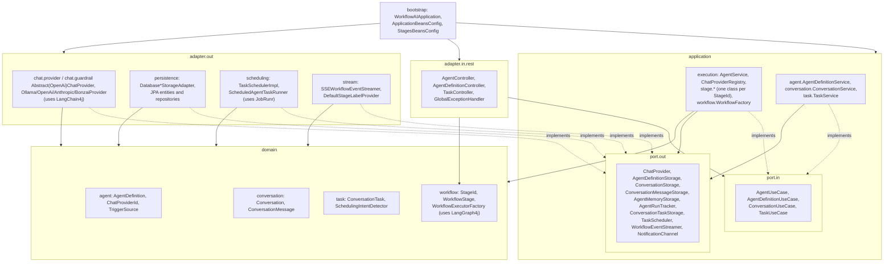
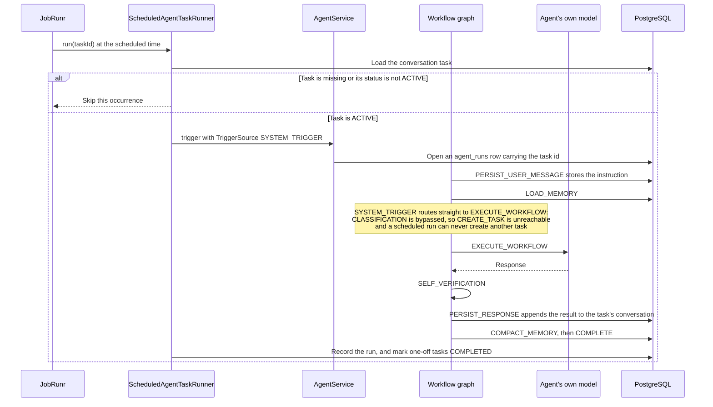

# Workflow AI

## Introduction

Workflow AI is a platform for building scoped, predictable agents. Every agent runs a fixed graph: the request is
classified first, then routed to exactly one generation path, then verified, persisted, and returned. The set of things
an agent can do with a request is enumerable before the request arrives: execute, schedule a task, clarify, greet,
redirect, or refuse. Nothing in the graph lets a model choose its own control flow.

Each step of that graph can use a different model. Classification, clarification, greeting, redirect, refusal, and
memory compaction are configured per stage via `application.yml` and typically point at a small local model. The agent's
own configured model is used only for the work the agent exists to do. Model choice per stage is a configuration value,
not an emergent property of a prompt.

The trade-off is deliberate. Unscoped agent frameworks let a single model decide what to do next, which tool to call,
and when to stop. That is more flexible and much harder to reason about. Here the shape is fixed, the possible outcomes
are known, the cost profile is knowable in advance, and adding a capability means changing code or configuration rather
than hoping a prompt generalises.

**Status:** PoC as a showcase for the idea, it is not production-ready.
See [Known Limitations & Chosen Scope](#known-limitations--chosen-scope)

### How this was built

The project was built with the help of Claude Code through prompt-driven iteration, with a minimal upfront spec. A
review pass over the whole codebase produced the first spec-like artifact, and after that point development moved to
scoped, ordered implementation prompts. Earlier code therefore reflects unplanned iteration and later code reflects
spec-first prompts. This is a process note, not a claim about quality.

See [SETUP.md](SETUP.md) for prerequisites, installation, running the application, and running the tests.

---

## Specs

Minimal behavioural specs for individual components live under [`/spec`](spec): purpose, inputs/outputs, acceptance
criteria, failure modes, edge cases, and non-goals per piece. This README keeps the big picture (architecture, the
graph, the flows, the API). The specs are the source of truth for exact behaviour, and the stage table below links each
stage to its file.

| Area                | Specs                                                                                  | Status                                  |
|---------------------|----------------------------------------------------------------------------------------|-----------------------------------------|
| Guardrails          | [`spec/guardrails`](spec/guardrails)                                                   | done                                    |
| Stages              | [`spec/stages`](spec/stages), one file per `StageId` (see the stage table below)       | done                                    |
| Workflow graph      | [`spec/workflow/StandardWorkflowGraph.md`](spec/workflow/StandardWorkflowGraph.md)     | done                                    |
| Task scheduling     | [`spec/task`](spec/task)                                                               | done                                    |
| Agent definitions   | [`spec/agent/AgentDefinitionService.md`](spec/agent/AgentDefinitionService.md)         | done                                    |
| SSE contract        | [`spec/sse`](spec/sse)                                                                 | done                                    |
| NotificationChannel | [`spec/notification/NotificationChannel.md`](spec/notification/NotificationChannel.md) | done (contract only, no implementation) |

---

## Core Concepts & Terminology

**Agent**: a database-backed definition (`AgentDefinition`) holding display details and an enabled flag, the workflow it
runs, its chat properties (provider, model, temperature, agent prompt, memory on/off), and its workflow policy. It is
the unit an admin edits and the unit a chat request is addressed to.

**Workflow**: a named, fixed graph of stages. `WorkflowId` enumerates the variants. `STANDARD` is the only one today.
`Workflow` is the runnable instance of a variant bound to one agent's properties.

**Workflow policy**: the per-agent constraints applied inside the workflow: the list of supported capabilities used for
routing, the response contract, and the fallback message used when a response cannot be generated.

**Stage**: one step of a workflow. Every stage implements `WorkflowStage`, reads `WorkflowState`, and returns the keys
it wants updated. Each `StageId` is either user-facing (visible to clients over SSE) or infrastructure (server-side
only).

The stages that exist today:

| Stage                    | Graph node         | User facing | Definition                                                                              | Spec                                              |
|--------------------------|--------------------|-------------|-----------------------------------------------------------------------------------------|---------------------------------------------------|
| `PERSIST_USER_MESSAGE`   | yes                | no          | Stores the incoming message on the conversation.                                        | [spec](spec/stages/PersistUserMessageStage.md)    |
| `LOAD_MEMORY`            | yes                | no          | Reads the conversation's compact memory blob when memory is enabled.                    | [spec](spec/stages/LoadMemoryStage.md)            |
| `CLASSIFICATION`         | yes                | yes         | Produces the routing decision. also extracts schedule details for `/schedule` requests. | [spec](spec/stages/ClassificationStage.md)        |
| `EXECUTE_WORKFLOW`       | yes                | yes         | Runs the agent's own model against the request.                                         | [spec](spec/stages/ExecuteWorkflowStage.md)       |
| `CREATE_TASK`            | yes                | yes         | Creates or updates the scheduled task for the conversation.                             | [spec](spec/stages/CreateTaskStage.md)            |
| `GENERATE_CLARIFICATION` | yes                | yes         | Produces a single clarifying question.                                                  | [spec](spec/stages/GenerateClarificationStage.md) |
| `GENERATE_GREETING`      | yes                | yes         | Produces a short greeting stating what the agent can help with.                         | [spec](spec/stages/GenerateGreetingStage.md)      |
| `GENERATE_REDIRECT`      | yes                | yes         | Points a mixed-scope request at its in-scope part.                                      | [spec](spec/stages/GenerateRedirectStage.md)      |
| `GENERATE_REFUSAL`       | yes                | yes         | Declines an out-of-scope or unsafe request.                                             | [spec](spec/stages/GenerateRefusalStage.md)       |
| `SELF_VERIFICATION`      | yes                | yes         | Checks the generated response against the response contract and retries once.           | [spec](spec/stages/SelfVerificationStage.md)      |
| `PERSIST_RESPONSE`       | no (shared helper) | no          | Saves the final response and emits it, called by every stage that produces one.         | Shared helper, no dedicated spec                  |
| `COMPACT_MEMORY`         | yes                | no          | Rewrites the conversation's memory blob after the visible turn.                         | [spec](spec/stages/CompactMemoryStage.md)         |
| `COMPLETE`               | yes                | yes         | Closes the turn and hands the result to notification channels.                          | [spec](spec/stages/CompleteStage.md)              |
| `GUARDRAIL_INPUT`        | no                 | no          | Declared with a label but never emitted. guardrailing happens inside the provider call. | [guardrails specs](spec/guardrails)               |
| `GUARDRAIL_OUTPUT`       | no                 | no          | Declared with a label but never emitted. guardrailing happens inside the provider call. | [guardrails specs](spec/guardrails)               |

`GENERATE_GREETING`, `GENERATE_REDIRECT`, and `GENERATE_REFUSAL` all delegate generation to the shared
`DecisionResponseGenerator` helper. see its [spec](spec/stages/DecisionResponseGenerator.md) for the common
fallback-on-failure contract.

**DecisionMode**: the routing verdict a request is reduced to: `GREET`, `EXECUTE`, `EXECUTE_SCHEDULE`, `CLARIFY`,
`REDIRECT`, `REFUSE`. The classifier only ever returns the other five. `EXECUTE_SCHEDULE` is derived in the graph when
an `EXECUTE` decision coincides with a scheduling request.

**Response contract**: what a valid generated response must look like: free text or JSON, an optional minimum length,
and for JSON an optional list of required top-level fields.

**Memory**: one compact text blob per `(conversation, agent)` pair, loaded into the model's system prompt and rewritten
after the visible turn completes.

**ConversationTask**: a standing instruction attached to one `(agent, conversation)` pair: the instruction to run, an
intent key used to deduplicate it, a schedule type (`ONCE`, `RECURRING`), a duration `PT5M`, a status (`ACTIVE`,
`PAUSED`, `COMPLETED`, `CANCELLED`), and last-run information.

**TriggerSource**: who started a run. `USER_MESSAGE` means a person sent a chat message. `SYSTEM_TRIGGER` means the
scheduler fired a `ConversationTask`. The two enter the graph at different points.

**Agent run**: one execution of a workflow, recorded with its trigger source, optional task id, timestamps, final
status, and failure message.

**Chat provider**: an adapter that can call one model family, selected per agent and per stage by id (`Anthropic`,
`Bonzai`, `Ollama`, `OpenAI`).

---

## Architecture

The code is organized into `domain`, `application` (with `port.in` / `port.out`), `adapter` (with `adapter.in` /
`adapter.out`), and `bootstrap` packages. The boundaries between them are not a documented convention, they are enforced
by `ArchitectureTest` (ArchUnit) as part of the test suite.

### Components and boundaries



The domain holds the model and the workflow definition and rules, the application layer owns the ports, execution, and
the orchestration, and adapters sit on the outside implementing those ports. `bootstrap` is the only package that is
allowed to know about all of them, since it exists to wire beans together.

### Dependency rules

Every rule below is one `@ArchTest` in `ArchitectureTest`, and a violation fails the build. The diagram shows exactly
what the test forbids (dashed arrows) and the two narrow exceptions it carves out (solid arrows), nothing more, nothing
less.


Domain must not depend on the application, on either adapter package, on Spring, or on LangChain4j, and outside
`domain.workflow`, not on LangGraph4j either. `domain.workflow` is the one place allowed to import LangGraph4j. The
application layer (including `application.port`) must not depend on either adapter package or on either AI framework.
LangChain4j may only be imported from `adapter.out.chat`, every other package, including
`bootstrap`, is checked and forbidden. And `adapter.in` and `adapter.out` must never depend on each other. Nothing here
is enforced beyond these nine assertions. anything else the packages happen to do today is convention, not a tested
rule.

The concrete package and file layout are in [SETUP.md](SETUP.md).

### The compiled workflow graph

This is the `STANDARD` graph as wired in `WorkflowExecutorFactory`, which is the only graph the application can build
today.


Three details of the graph are worth stating because the diagram alone can mislead:

- There is no separate schedule-extraction node. `CLASSIFICATION` extracts the schedule type and duration alongside the
  decision when `schedulingRequested` is set. See its [spec](spec/stages/ClassificationStage.md).
- `PERSIST_RESPONSE` is not a node. It is a helper that every terminal stage calls, so the response is saved before any
  of it is emitted.
- `CREATE_TASK` can re-route into `GENERATE_CLARIFICATION` or `GENERATE_REFUSAL` when the extracted schedule cannot be
  used. See the [workflow graph spec](spec/workflow/StandardWorkflowGraph.md) for the full routing table.

Three frameworks carry most of the weight, and each one is confined to a single concern. LangChain4j provides the
per-provider chat and streaming chat models and the input/output guardrail interfaces, which is why guard railing
happens at the provider boundary rather than as its own stage. LangGraph4j compiles the stage graph and executes it and
also renders it as Mermaid, which is how the admin UI stays in sync with the real graph rather than a drawing of it.
JobRunr runs the scheduled tasks, storing their own state in the same PostgreSQL instance under a separate schema. The
full technology list lives in [SETUP.md](SETUP.md).

---

## Main Functions & Execution Flows

### Chat

A user message enters through the chat endpoint, is classified, routed to exactly one generation path, verified,
persisted, and streamed back. The response is saved before the first token is emitted, so a dropped SSE connection never
loses the answer.


Details the diagram compresses:

- Use `NEW_CONVERSATION` as the conversation path value to create the conversation on the first request.
- `GENERATE_CLARIFICATION` prefers the classifier's own question over generating one. see its
  [spec](spec/stages/GenerateClarificationStage.md) for the exact fallback rule.
- `EXECUTE_WORKFLOW` treats a guardrail-blocked input as already-final rather than retrying. see its
  [spec](spec/stages/ExecuteWorkflowStage.md).
- `SELF_VERIFICATION` retries at most once and always accepts the retry's result as final. see its
  [spec](spec/stages/SelfVerificationStage.md) for the exact `STAGE`/`FAILED` signalling.
- Memory compaction runs as the last stage, only when memory is enabled. See
  [`CompactMemoryStage`](spec/stages/CompactMemoryStage.md) for when it's skipped.

### Schedule creation

A message prefixed with `/schedule` asks the agent to keep doing something. The prefix is stripped before the message
reaches the model, `CLASSIFICATION` extracts the timing and the instruction, and `CREATE_TASK` upserts the task and
confirms it. Two conditions refuse outright: an instruction outside the agent's supported capabilities, and an
instruction that is itself a request to schedule something.


The capability check happens once, at classification time, since the stored instruction runs again later without further
review. see [`CreateTaskStage`](spec/stages/CreateTaskStage.md) for the exact refusal/clarify rules and
[`StandardWorkflowGraph`](spec/workflow/StandardWorkflowGraph.md) for how `CREATE_TASK` re-routes.

Repeating the same `/schedule` request does not accumulate tasks. See [`TaskService`](spec/task/TaskService.md)
for the dedup-by-intent-key rule.

### Scheduled execution

When JobRunr fires, the task's instruction is replayed through the same graph, entering at a different point.



Bypassing classification has two consequences worth being explicit about: capability scope is only checked once, at
creation time, and a scheduled run can never create another task, belt and braces, since `CREATE_TASK` also refuses
system-triggered runs if it's ever reached another way. See
[`ScheduledAgentTaskRunner`](spec/task/ScheduledAgentTaskRunner.md) and
[`CreateTaskStage`](spec/stages/CreateTaskStage.md). Guardrails still apply because they live in the provider call.

The result is visible in the conversation the task belongs to. `NotificationChannel` exists as a port for pushing it
somewhere else but has no implementation yet. see its [spec](spec/notification/NotificationChannel.md) for the contract
a future implementer must satisfy.

### Admin

`admin.html` edits `AgentDefinition` records through the admin API. One agent is selected from the list on the left, and
its properties are split across three tabs, all saved together by the single form:

- **Overview:** reads and writes `details`: the enabled flag, display name, and description. The agent id is shown
  read-only.
- **Instructions & Policy:** reads and writes `chatProperties.agentPrompt` and the whole of `workflowPolicy`:
  supported capabilities, the failed-to-process fallback, and the response contract (format, minimum length, and
  required JSON fields when the format is JSON).
- **Workflow:** reads and writes `workflowId` and the rest of `chatProperties`: chat provider, model, temperature, and
  the memory flag. The provider and model dropdowns are populated from
  `GET /api/admin/agents/supported-chat-providers`, and the model list is filtered by the selected provider. Below the
  fields, the agent's compiled graph is fetched as Mermaid text and rendered.

Two things the admin UI does not do. Per-stage model tiering is not editable there: the stage models live in
`workflow-ai.stages` in `application.yml` and require a restart. And scheduled tasks are managed from the chat UI, not
here. `chat.html` has a **Tasks** tab listing the current conversation's tasks with their schedule, status, next run,
and last run, and offering pause, resume, and cancel.

Agents are cached in memory once built, and saving/updating through the admin API reloads the affected agent so the edit
takes effect immediately. see [`AgentDefinitionService`](spec/agent/AgentDefinitionService.md) for the exact
validate-then-persist-then-reload contract.

### Adapters

Adding a model provider is the extension point a contributor is most likely to touch. A provider is one class in
`adapter.out.chat.provider` implementing the `ChatProvider` outbound port, which is deliberately small: an id, a
buffered `call`, a token-consuming `stream`, and the set of models it supports.

Most of the work is already shared. `AbstractChatProvider` builds the message list, applies the input guardrail before
the call and the output guardrail to the result, falls back to the provider's default model when a requested model is
not supported, and turns LangChain4j's streaming callbacks into a synchronous call that returns the full text.
`AbstractOpenAiProvider` adds a complete implementation for any OpenAI-compatible endpoint: `OpenAiProvider`
and `BonzaiProvider` both build on it, and Bonzai adds nothing beyond its own configuration record.
`OllamaProvider` and `AnthropicProvider` extend `AbstractChatProvider` directly because their model builders differ.
`OllamaProvider` additionally checks `/api/tags` and fails with instructions to pull the missing model.

To add one: add a value to `ChatProviderId`, add a `@Component` extending `AbstractOpenAiProvider` for an
OpenAI-compatible endpoint or `AbstractChatProvider` otherwise, give it a nested `@ConfigurationProperties` record with
base URL, key, default model, default temperature, and supported models, and add the matching block to
`application.yml`. Note that the existing providers are split between `langchain4j.*` and, for Bonzai,
`workflow-ai.chat-providers.bonzai`, so follow whichever prefix your record declares. `ChatProviderRegistry` collects
every
`ChatProvider` bean by id, so nothing needs registering by hand. the new provider immediately appears in the admin
dropdowns and can be selected per agent and per stage.

---

## APIs & SSE Events

### Agents and chat API

```text
GET    /api/agents
GET    /api/agents/{agentId}
GET    /api/agents/{agentId}/conversations
DELETE /api/agents/{agentId}/conversations/{conversationId}
GET    /api/agents/{agentId}/conversations/{conversationId}/messages
POST   /api/agents/{agentId}/conversations/{convId}/chat
GET    /api/agents/{agentId}/conversations/{conversationId}/tasks
POST   /api/agents/{agentId}/conversations/{conversationId}/tasks/{taskId}/pause
POST   /api/agents/{agentId}/conversations/{conversationId}/tasks/{taskId}/resume
POST   /api/agents/{agentId}/conversations/{conversationId}/tasks/{taskId}/cancel
```

`POST .../chat` takes `{"message": "..."}` and responds with `text/event-stream`:

```bash
curl -N -X POST http://localhost:8080/api/agents/$AGENT_ID/conversations/NEW_CONVERSATION/chat \
  -H 'Content-Type: application/json' \
  -d '{"message": "Write a user story for password reset."}'
```

### Admin API

```text
GET    /api/admin/agents/supported-chat-providers
GET    /api/admin/agents
GET    /api/admin/agents/{agentId}
GET    /api/admin/agents/{agentId}/workflowDiagram
POST   /api/admin/agents
PUT    /api/admin/agents/{agentId}
DELETE /api/admin/agents/{agentId}
```

`POST` and `PUT` take a full `AgentDefinition`. `PUT` ignores the body's `agentId` in favour of the path value.
`workflowDiagram` returns Mermaid text as `text/plain`.

```json
{
  "agentId": "6ca207fa-30be-43f0-b4b3-a7e2a1ea650e",
  "workflowId": "STANDARD",
  "details": {
    "displayName": "Product Owner Agent",
    "description": "Turns product requests into user stories and acceptance criteria.",
    "enabled": true
  },
  "chatProperties": {
    "providerId": "Ollama",
    "model": "gemma4:26b",
    "agentPrompt": "You help product teams write scoped user stories.",
    "temperature": 0.4,
    "memoryEnabled": true
  },
  "workflowPolicy": {
    "supportedCapabilities": [
      "user stories",
      "acceptance criteria",
      "release notes"
    ],
    "responseContract": {
      "format": "TEXT",
      "requiredFields": [],
      "minLength": 0
    },
    "fallbackFailedToProcess": "I could not process that safely right now. Please try again with a product-planning request."
  }
}
```

### SSE events

Event names are the `EventType` constants, upper snake case: `CONVERSATION_CREATED`, `STAGE`, `DECISION`, `TOKEN`,
`RESPONSE_COMPLETED`, `CONVERSATION_COMPLETED`, `MEMORY_UPDATED`, `ERROR`. Only user-facing stages produce `STAGE`
events. The full mapping, exact payload shape per event, and which events are actually reachable today, is in the
[EventType contract spec](spec/sse/EventTypeContract.md). how each event is built and delivered per run is in the
[`SSEWorkflowEventStreamer` spec](spec/sse/SSEWorkflowEventStreamer.md).

---

## Known Limitations & Chosen Scope

### Not yet implemented

- **Responses are not streamed as they are generated.** `EXECUTE_WORKFLOW` and the greeting, redirect, and refusal
  stages pass a discarding token consumer to the provider and buffer the whole response. `EXECUTE_WORKFLOW` has to,
  because `SELF_VERIFICATION` may reject the draft. Clarification does not stream at all. `PERSIST_RESPONSE` then
  re-emits the finished text as `TOKEN` events. The SSE contract is streaming. the experience is a burst.
- **Guardrail stages are never emitted.** `GUARDRAIL_INPUT` and `GUARDRAIL_OUTPUT` have ids and UI labels, but
  guard-railing happens inside the provider call, so clients never see a guardrail step. see the
  [guardrails specs](spec/guardrails) and the [EventType contract](spec/sse/EventTypeContract.md).
- **Notifications go nowhere.** `NotificationChannel` has no implementation, so `COMPLETE`'s fan-out is a no-op and a
  scheduled result is only visible in its conversation. see its [spec](spec/notification/NotificationChannel.md).
- **Schedule validation leans entirely on the classifier prompt.** `CREATE_TASK` catches malformed schedule values
  (`DateTimeParseException`/`IllegalArgumentException`/`InvalidScheduleException`) and routes them to `CLARIFY`, and a
  too-frequent schedule to `REFUSE` on `ScheduleTooFrequentException`. A `scheduleType` or `startDateTime` missing
  entirely from the classifier's decision is caught the same way today and asks for clarification. see [
  `CreateTaskStage`](spec/stages/CreateTaskStage.md) for the intended behaviour.
- **Self-verification gives up after one retry.** A response that is still invalid is persisted and returned as the best
  effort. see [`SelfVerificationStage`](spec/stages/SelfVerificationStage.md).
- **The agent cache is only invalidated by the admin API.** `AgentService` keeps built agents in an in-memory map and
  only rebuilds one when `saveDefinition`/`updateDefinition` calls `reload`. A definition changed by any other route (a
  direct database edit, for instance) would not be picked up until the process restarts.

### Intentionally out of scope

These are decisions, not a backlog.

- **More workflows and stages.** `WorkflowId` has one value and `WorkflowExecutorFactory` builds one graph. New variants
  and stages get added when a real requirement needs them, not speculatively, and the graph is intentionally not
  user-editable, since a fixed, inspectable shape is the point of the project.
- **Multi-tenancy, agent ACLs, and user management.** There is no user in the model at all: conversations belong to
  agents. Adding identity, ownership, and per-agent access control would change the data model throughout, and this tool
  has no use for it.
- **Hosting local models.** Ollama is consumed as an already-running endpoint through a provider adapter, which checks
  that a model is present and tells you to `ollama pull` it yourself. Managing local inference servers. Ollama, vLLM, or
  anything else, as pluggable provider connections owned by this project is not something it will do. new engines arrive
  as adapters against endpoints someone else runs.
- **Production deployment.** This project is not intended to be deployed. If that ever changed, each of the following
  would need evaluating first, and none of them is a commitment: authentication and authorization on both API surfaces.
  secrets management, since provider keys and the datasource password are plain values in
  `application.yml` today. observability and tracing across stages and model calls. rate limits and cost controls.
  backups and a retention policy for conversations, memory and run history. and multi-tenant data isolation.
